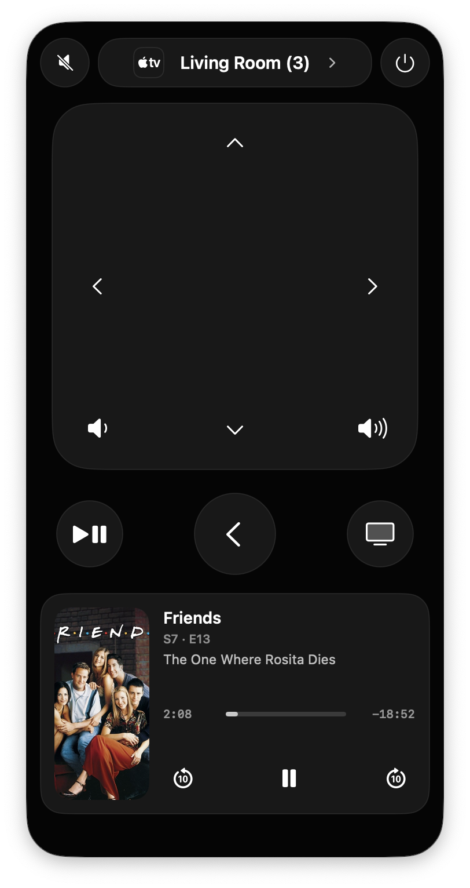
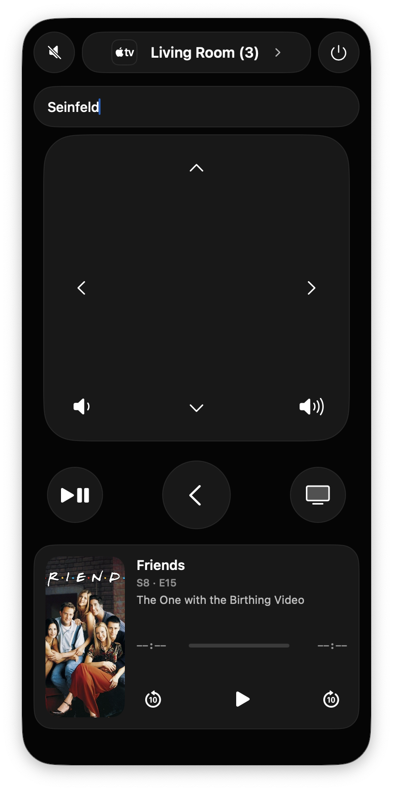
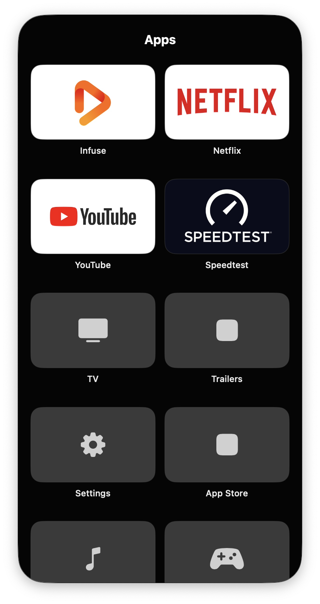
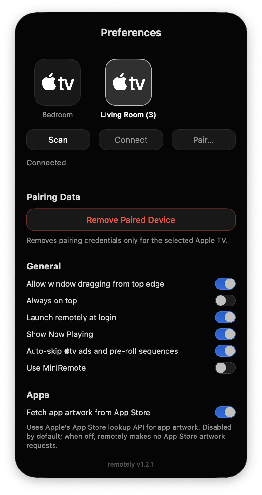
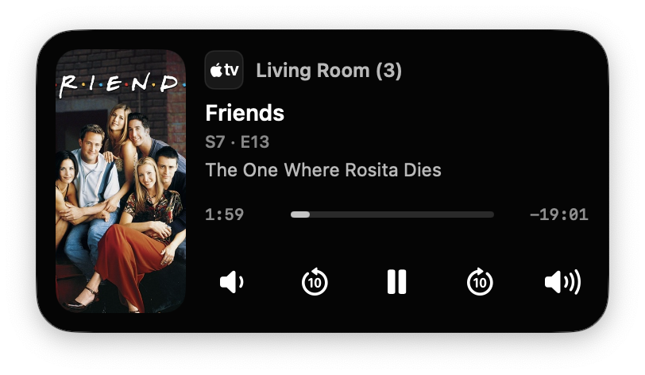

<p align="center">
  <br/>
  A native macOS menu-bar remote for Apple TV, with Now Playing controls, app launching, keyboard input, and a compact MiniRemote.
</p>

<p align="center">
  
  
  
  
</p>

<p align="center">
  
</p>

## Features

- Full Apple TV remote with clickpad, navigation, playback, volume, and power controls
- Now Playing artwork and metadata with seekable timeline and ±10 second skipping
- MiniRemote for a compact always-available control surface
- Launch installed Apple TV apps directly from macOS
- Keyboard Search when Apple TV requests text input
- Discover, pair, and switch between multiple Apple TVs
- Optional always-on-top mode, launch at login, and remembered window position

## Requirements

- macOS 14 Sonoma or later
- Xcode or the Xcode Command Line Tools with Swift available
- An Apple TV on the same local network
- Internet access during the first build to fetch pinned source dependencies

## Build

From the project directory, run:

```zsh
./scripts/build.sh
```

The build script validates the source, fetches the pinned dependencies, builds and signs `remotely.app`, installs it in `/Applications`, and launches it.

On the first build, macOS may ask for permission to create/trust the local code-signing identity or to install the app.

### Other scripts

All maintenance scripts live in `scripts/`:

```text
scripts/validate_source.sh  Validate source/build invariants
scripts/clean.sh            Remove local build output
scripts/install.sh          Install an already-built app
scripts/setup_signing.sh    Prepare the persistent local signing identity
```

## Notes

remotely communicates directly with Apple TV over the local network. Pairing credentials are stored in the macOS Keychain.

Third-party components and notices are listed in [THIRD_PARTY_NOTICES.md](THIRD_PARTY_NOTICES.md).
